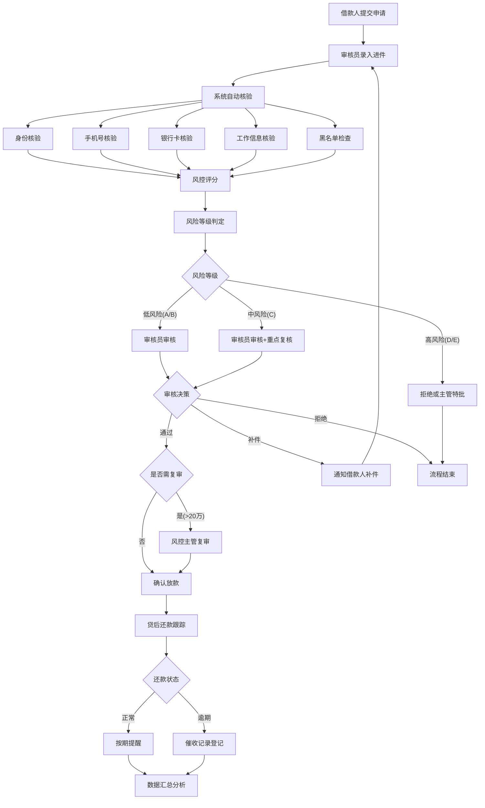

# 小额贷款风控审核台 产品需求文档

## 1. 产品概述

小额贷款风控审核台是一款面向助贷机构的专业风控管理系统，为审核员和风控主管提供全流程贷款审核能力。系统覆盖进件录入、多维度核验、智能评分、人工审核、贷后管理及数据分析六大核心环节，帮助机构提升审核效率、降低坏账风险。

- 目标用户：助贷机构审核员、风控主管
- 核心价值：标准化审核流程、智能风控决策、全生命周期风险管控

## 2. 核心功能

### 2.1 用户角色

| 角色 | 注册方式 | 核心权限 |
|------|----------|----------|
| 审核员 | 机构分配账号 | 进件录入、核验操作、查看评分、提交审核意见、催收记录登记 |
| 风控主管 | 机构分配账号 | 全部审核员权限、复审审批、额度调整、报表导出、风险规则配置 |

### 2.2 功能模块

1. **首页（Dashboard）**：申请量统计、通过率趋势、逾期预警、待办任务列表
2. **进件页**：借款人基本资料录入、证件上传、联系人信息补充
3. **核验页**：身份核验、手机号核验、银行卡核验、工作信息核验、黑名单检查
4. **评分页**：风险等级展示、命中规则详情、额度建议、利率建议
5. **审核页**：人工批注、补件通知、拒绝决策、复审提交、放款确认
6. **贷后页**：还款计划跟踪、逾期天数统计、催收记录、风险迁移分析
7. **报表页**：渠道维度分析、城市维度分析、产品维度分析、数据导出

### 2.3 页面详情

| 页面名称 | 模块名称 | 功能描述 |
|----------|----------|----------|
| 首页 | 数据概览卡片 | 今日申请量、本月通过率、逾期金额、待办数量 |
| 首页 | 趋势图表 | 近30天申请量折线图、通过率趋势图 |
| 首页 | 逾期预警 | 高危逾期客户列表、逾期天数标签 |
| 首页 | 待办任务 | 待核验、待审核、待补件任务列表 |
| 进件页 | 借款人资料 | 姓名、身份证号、手机号、婚姻状况、学历、居住地址 |
| 进件页 | 证件上传 | 身份证正反面、人脸识别、银行卡照片 |
| 进件页 | 联系人信息 | 直系亲属、紧急联系人、同事联系人录入 |
| 进件页 | 贷款信息 | 申请金额、期限、用途、还款方式 |
| 核验页 | 身份核验 | 身份证OCR结果、人脸比对分数、公安系统校验 |
| 核验页 | 手机号核验 | 运营商认证、在网时长、实名状态 |
| 核验页 | 银行卡核验 | 卡号有效性、四要素验证、开户行信息 |
| 核验页 | 工作信息 | 单位名称、职位、入职时间、薪资流水核验 |
| 核验页 | 黑名单检查 | 司法黑名单、多头借贷、逾期记录查询 |
| 评分页 | 风险评分卡 | 总分、ABCDE风险等级、颜色标识 |
| 评分页 | 命中规则 | 规则列表、规则分值、规则严重程度 |
| 评分页 | 额度建议 | 建议额度区间、授信依据、负债计算 |
| 评分页 | 利率建议 | 年化利率、综合成本、定价策略 |
| 审核页 | 审核意见 | 人工批注、审核备注、附件上传 |
| 审核页 | 操作按钮 | 通过、补件、拒绝、复审、放款确认 |
| 审核页 | 补件清单 | 需补充材料列表、截止日期、提醒状态 |
| 审核页 | 审核轨迹 | 审核流程节点、操作人、操作时间 |
| 贷后页 | 还款计划 | 期数、应还日期、应还金额、实还金额、状态 |
| 贷后页 | 逾期统计 | 逾期天数、逾期金额、滞纳金、催收次数 |
| 贷后页 | 催收记录 | 催收方式、催收时间、催收结果、承诺还款时间 |
| 贷后页 | 风险迁移 | 贷前等级→当前等级、迁移原因、风险变动趋势 |
| 报表页 | 筛选条件 | 时间范围、渠道、城市、产品多维筛选 |
| 报表页 | 渠道分析 | 各渠道申请量、通过率、放款量、逾期率对比 |
| 报表页 | 城市分析 | 城市分布热力、Top10城市数据 |
| 报表页 | 产品分析 | 各产品规模、收益、风险指标 |
| 报表页 | 数据导出 | Excel/PDF格式导出、自定义报表模板 |

## 3. 核心流程

贷款审核全流程：借款人提交申请 → 审核员录入进件 → 系统自动核验（身份/手机号/银行卡/工作/黑名单）→ 风控评分模型计算风险等级 → 审核员人工审核（通过/补件/拒绝）→ 主管复审（大额/高风险件）→ 确认放款 → 贷后跟踪还款/催收 → 数据汇总分析。

## 4. 用户界面设计

### 4.1 设计风格

- 主色调：深蓝 `#1E3A5F`（专业、信任）、辅色：青绿 `#0891B2`（数据、科技）
- 警示色：红色 `#DC2626`（逾期/拒绝）、橙色 `#F59E0B`（预警/补件）、绿色 `#059669`（通过/正常）
- 按钮风格：圆角6px，扁平化设计，hover时轻微上浮阴影
- 字体：中文「思源黑体」+ 数字「JetBrains Mono」，正文14px，标题16-24px
- 布局风格：左侧导航栏 + 顶部信息栏 + 主内容卡片式布局
- 图标风格：线性图标，统一16px/20px尺寸
- 背景：浅灰渐变底色 + 卡片白色背景 + 细腻分割线
- 视觉细节：表格斑马纹、状态标签色、数据卡片数字放大显示

### 4.2 页面设计概览

| 页面名称 | 模块名称 | UI元素 |
|----------|----------|--------|
| 首页 | 数据概览 | 4张渐变背景数字卡片 + 箭头趋势指示 |
| 首页 | 图表区域 | 双折线图对比（申请量/通过率）+ 环形图（风险分布） |
| 首页 | 预警/待办 | 左右分栏，逾期列表带红色标签，待办列表可点击跳转 |
| 进件页 | 表单区域 | 分区折叠面板（基本信息/证件/联系人/贷款），必填红星标识 |
| 进件页 | 上传组件 | 身份证正反面框线拖拽区 + 人脸圆形捕获区 |
| 核验页 | 核验结果 | 5个核验模块，每项带通过/警告/失败三色圆形标识 |
| 核验页 | 详情展开 | 点击核验项展开明细数据，进度条显示核验置信度 |
| 评分页 | 评分仪表盘 | 半圆仪表盘动画显示分数，中心显示等级字母 |
| 评分页 | 规则列表 | 按严重程度分组的规则列表，减分值高亮显示 |
| 评分页 | 额度/利率 | 左右双卡片，区间进度条 + 建议值突出显示 |
| 审核页 | 审批面板 | 左侧申请摘要 + 中间审核意见 + 右侧操作按钮组 |
| 审核页 | 流程轨迹 | 垂直时间轴，节点状态颜色区分 |
| 贷后页 | 还款计划 | 日历样式还款日标记 + 表格行背景色区分状态 |
| 贷后页 | 风险迁移 | 桑基图风格迁移路径 + 前后等级对比卡片 |
| 报表页 | 筛选区 | 标签页切换维度 + 下拉筛选器组 |
| 报表页 | 数据区 | 堆叠柱状图 + 数据透视表 + 右上角导出按钮组 |

### 4.3 响应式设计

- 桌面端优先设计（1440px基准）
- 平板适配（≥1024px）：导航栏收起为图标模式
- 数据密集型表格区域提供横向滚动容器
- 移动端不做主要适配，保留基础可用性

### 4.4 动画与交互

- 页面切换：淡入过渡 200ms
- 数据卡片：入场依次延迟 50ms 渐入上移动画
- 仪表盘分数：加载时从0到目标值数字滚动动画
- 状态变化：通过/拒绝操作后带成功/失败确认弹窗动效
- 表格行：hover时浅蓝背景高亮
- 导航项：当前页左侧青蓝色高亮指示条
