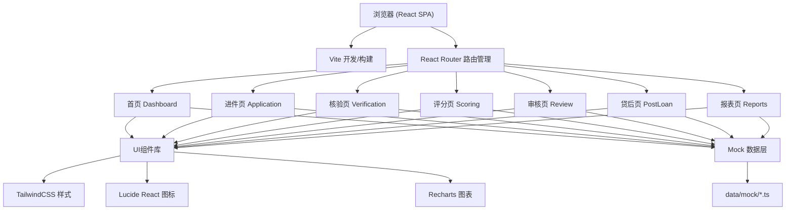
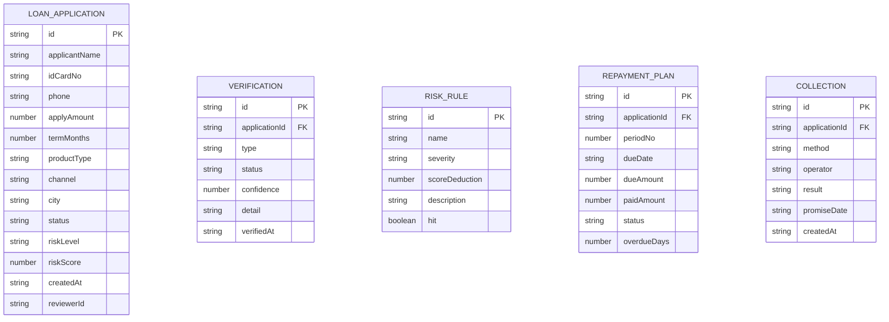

# 小额贷款风控审核台 技术架构文档

## 1. 架构设计



## 2. 技术选型说明

- 前端框架：React 18 + TypeScript（类型安全、组件化开发）
- 构建工具：Vite 5（快速冷启动、HMR热更新）
- 样式方案：TailwindCSS 3（原子化CSS、设计系统一致性）
- 路由管理：React Router v6（SPA路由、嵌套路由）
- 图表库：Recharts（React生态、声明式配置）
- 图标库：Lucide React（轻量线性图标、一致性）
- 数据管理：内置 Mock 数据（纯前端演示，无后端依赖）
- 无后端服务：所有数据使用本地 TypeScript Mock 数据模拟

## 3. 路由定义

| 路由路径 | 页面名称 | 说明 |
|----------|----------|------|
| `/` | 首页 Dashboard | 仪表盘，数据概览、趋势、预警、待办 |
| `/application` | 进件页 | 借款人资料录入、证件上传、联系人补充 |
| `/verification` | 核验页 | 身份/手机号/银行卡/工作/黑名单核验 |
| `/scoring` | 评分页 | 风险等级、命中规则、额度/利率建议 |
| `/review` | 审核页 | 人工批注、补件/拒绝/复审/放款操作 |
| `/post-loan` | 贷后页 | 还款计划、逾期催收、风险迁移 |
| `/reports` | 报表页 | 渠道/城市/产品维度分析与导出 |

## 4. 数据模型

### 4.1 核心数据模型定义



### 4.2 核心类型定义（TypeScript）

```typescript
// 进件申请
interface LoanApplication {
  id: string;
  applicantName: string;
  idCardNo: string;
  phone: string;
  gender: 'male' | 'female';
  age: number;
  maritalStatus: string;
  education: string;
  address: string;
  applyAmount: number;
  termMonths: number;
  loanPurpose: string;
  repaymentMethod: string;
  productType: string;
  channel: string;
  city: string;
  status: 'pending' | 'verifying' | 'scoring' | 'reviewing' | 'approved' | 'rejected' | 'disbursed' | 'completed';
  riskLevel: 'A' | 'B' | 'C' | 'D' | 'E';
  riskScore: number;
  createdAt: string;
  reviewer?: string;
  documents: Document[];
  contacts: Contact[];
}

// 核验结果
interface VerificationResult {
  id: string;
  applicationId: string;
  type: 'identity' | 'phone' | 'bankcard' | 'employment' | 'blacklist';
  status: 'pass' | 'warning' | 'fail';
  confidence: number;
  details: VerificationDetail[];
  verifiedAt: string;
}

// 风控规则
interface RiskRule {
  id: string;
  name: string;
  severity: 'critical' | 'high' | 'medium' | 'low';
  scoreDeduction: number;
  description: string;
  hit: boolean;
}

// 还款计划
interface RepaymentItem {
  id: string;
  applicationId: string;
  periodNo: number;
  dueDate: string;
  principal: number;
  interest: number;
  dueAmount: number;
  paidAmount: number;
  status: 'pending' | 'paid' | 'overdue';
  overdueDays: number;
  penalty: number;
}

// 催收记录
interface CollectionRecord {
  id: string;
  applicationId: string;
  method: 'phone' | 'sms' | 'onsite' | 'letter';
  operator: string;
  result: 'promised' | 'unreachable' | 'refused' | 'partial';
  contactPerson: string;
  remark: string;
  promiseDate?: string;
  createdAt: string;
}
```

## 5. 项目目录结构

```
src/
├── assets/              # 静态资源（图片、字体等）
├── components/          # 公共组件
│   ├── Layout/         # 布局组件（Sidebar、Header）
│   ├── UI/             # 基础UI组件（Button、Card、Table、Tag等）
│   └── Charts/         # 图表组件封装
├── data/               # Mock 数据
│   ├── applications.ts
│   ├── verifications.ts
│   ├── riskRules.ts
│   ├── repayments.ts
│   └── reports.ts
├── pages/              # 页面组件
│   ├── Dashboard.tsx
│   ├── Application.tsx
│   ├── Verification.tsx
│   ├── Scoring.tsx
│   ├── Review.tsx
│   ├── PostLoan.tsx
│   └── Reports.tsx
├── types/              # TypeScript 类型定义
│   └── index.ts
├── utils/              # 工具函数
│   ├── format.ts       # 金额、日期格式化
│   └── helpers.ts
├── App.tsx             # 根组件（路由配置）
├── main.tsx            # 入口文件
└── index.css           # 全局样式 + Tailwind 配置
```

## 6. 组件设计规范

### 6.1 布局组件
- `Sidebar`：左侧导航栏，支持路由高亮，桌面端固定宽度240px
- `Header`：顶部栏，面包屑 + 用户信息 + 消息通知
- `PageContainer`：页面容器，统一样式内边距和背景

### 6.2 基础UI组件
- `StatCard`：数据统计卡片（首页用），渐变背景 + 趋势箭头
- `StatusTag`：状态标签，根据状态类型配色
- `RiskBadge`：风险等级徽章（A-E五级，颜色递进）
- `DataTable`：通用数据表格，支持斑马纹、hover高亮
- `ProgressBar`：进度条组件（核验页、评分页用）
- `Timeline`：时间轴组件（审核轨迹用）
- `UploadZone`：文件拖拽上传区（进件页证件上传）

### 6.3 图表组件
- `LineChartCard`：折线图卡片（趋势分析）
- `BarChartCard`：柱状图卡片（对比分析）
- `PieChartCard`：环形/饼图卡片（占比分析）
- `GaugeChart`：半圆仪表盘（评分页风险分数展示）
